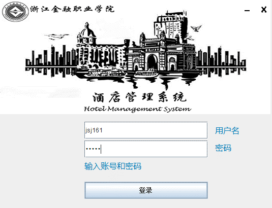
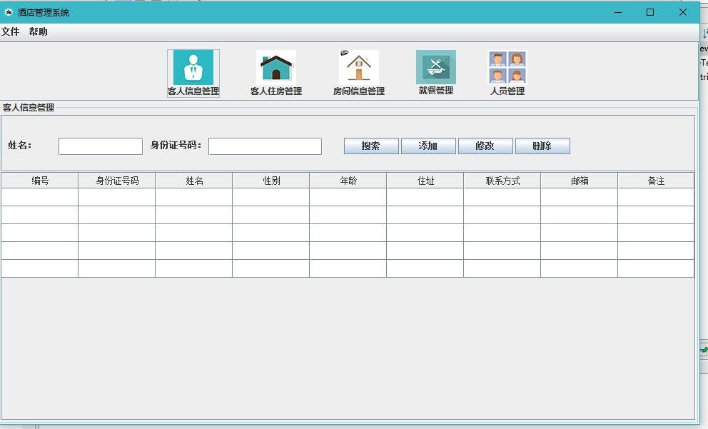
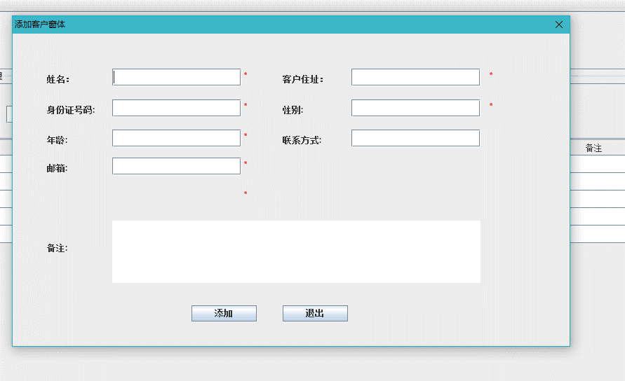

# Hotel Management System | 酒店管理系统

## Overview

A **Java-based hotel management system** developed with a **Swing graphical interface** and **SQL Server** backend.
It supports full-stack operations including guest records, room data, check-in/out handling, billing, and user role management.
The backend leverages JDBC to ensure secure, efficient database interactions, and the architecture follows modular, object-oriented principles.

The system is built using a **modular, object-oriented architecture**, divided into two components:  
- `hotelAuthServer`: Dedicated authentication server for user login
- `hotel`: Main client application with all core functions

  
## Technical Highlights
- Swing-based interface using BorderLayout, JPanel, and custom painting
- All operations handled with robust JDBC logic
- Clear user/admin role separation with tailored access
- Drag-and-drop login window with centring logic
- User prompts through `JOptionPane`.  
- Background rendering via `paintComponent()`.  


## Core Functional Modules

### 1. Guest Information Management
- Add, edit, delete, and search guest records
- Fields include name, gender, ID number, contact info, work unit, room number 
- Role-based access: guests view only personal data, admins manage all
  
### 2. Room Management
- Manage hotel room data: room ID, type, phone, price, and status (available / occupied).  
- Supports full CRUD operations

### 3. Check-in / Check-out Management
- Manage guest check-in and checkout flows
- Includes deposit tracking and automatic bill calculation
- Searchable by guest name, ID, or room number

### 4. Dining Management
- Records food orders and guest consumption
- Tracks dish name, quantity, unit price, and total
- Accessible to both guests and administrators


### 5. Billing Management
- Consolidated tracking of deposits, charges, and settlements
- Auto-calculation of room + dining cost
- Generates final invoice on checkout

### 6. System Maintenance
- Login authentication for system admins
- Database reset and maintenance tools
- Operation logs stored in `hotel_log.ldf`.


## Database Design
The database is located in the `shujuk/` folder.

**Files:**
- `hotel.mdf`: Main database file  
- `hotel_log.ldf`: Log file

**Main Tables:**

| Table Name | Description | Key Fields |
|-------------|--------------|-------------|
| 管理员表 (Admin) | System administrators | 编号, 姓名, 密码 |
| 顾客表 (Customer) | Guest personal information | 身份证号, 姓名, 性别, 联系方式, 预定房间 |
| 客房标准信息表 (RoomInfo) | Room details | 客房编号, 类型, 电话, 价格 |
| 订房表 (Booking) | Room reservation records | 客房编号, 客户类型, 客户姓名, 押金, 入住时间 |
| 退房表 (Checkout) | Guest checkout and payment info | 客房编号, 入住人数, 退房时间, 结算金额 |


## Project Structure
```
HotelManagementSystem/
│
├── 项目源文件（src）/
│ ├── hotelAuthServer/ # 登录认证服务端
│ │ ├── .settings/
│ │ ├── bin/
│ │ └── src/
│ │ └── common/
│ │
│ └── hotel/ # 主程序客户端
│ ├── .settings/
│ ├── bin/
│ └── src/
│ ├── common/ # 公共功能模块
│ ├── purchase/ # 采购模块
│ ├── seller/ # 餐饮或销售模块
│ ├── supplier/ # 供应商管理模块
│ └── user/ # 用户与登录模块
│
├── shujuk(database)/ # 数据库文件夹
│ ├── hotel.mdf
│ └── hotel_log.ldf
│
└── README.md
```


## System Environment

| Component | Description |
|------------|-------------|
| Language | Java |
| IDE | Eclipse |
| Database | Microsoft SQL Server |
| Paradigm | Object-Oriented Programming (OOP) |
| GUI Framework | Swing |
| Database Access | JDBC |


## Default Login 
- **Username:** `jsj161`  
- **Password:** `123456`


## Interface Screenshots

### Login


### Main Menu


### Guest Info



