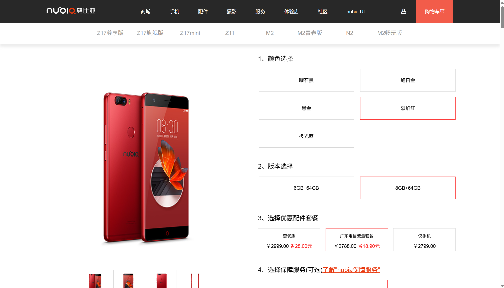
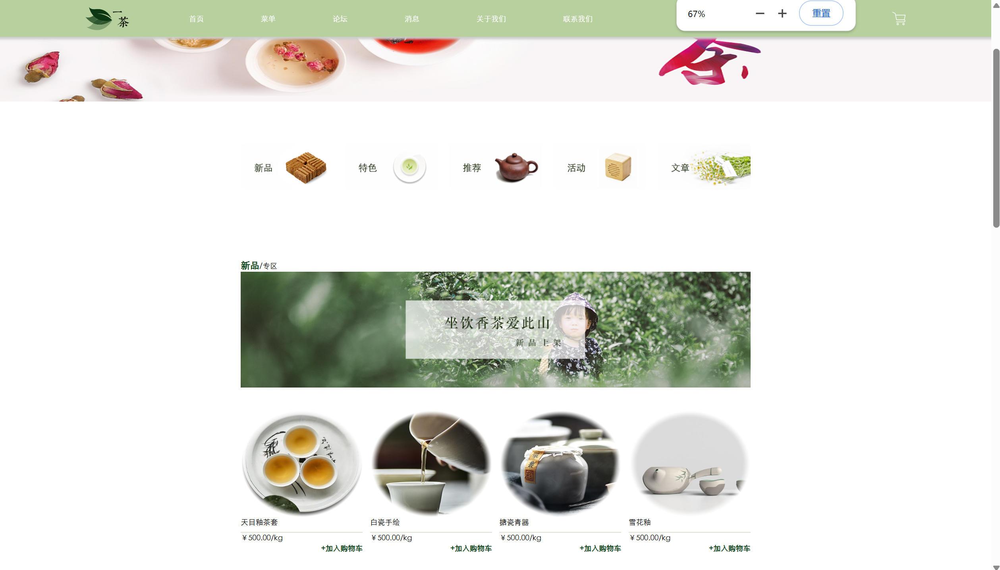
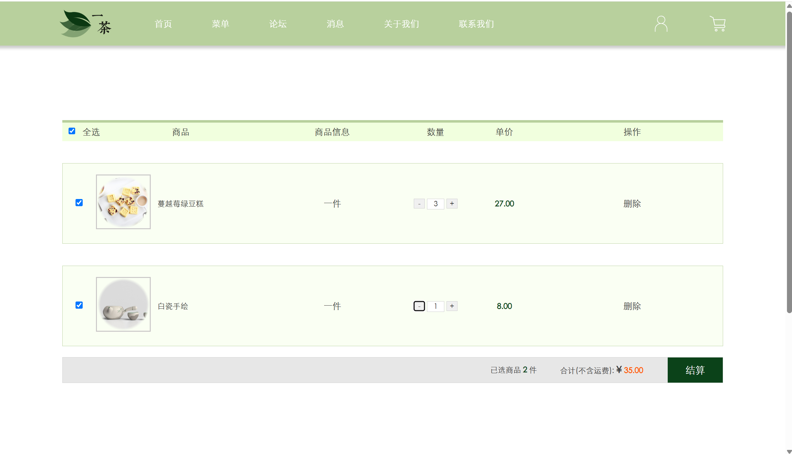

# Web_Projects

This folder presents a series of **web development projects** completed during early-stage practice.
Each project focuses on specific aspects of **front-end design, UI interactivity, and dynamic data management**.

| No.| Project | Type | Core Tech | Focus |
|---|----------|-------|-----------|--------|
|1| **LegalAid_Platform_Prototype (Figma)** | UI/UX | Figma / Pixso / UCD Principle | User-centred design, accessibility, workflow visualization |
|2| **Mobile_ECommerce_Mockup** | Static | HTML / CSS / JS | Responsive layout, animation, carousel |
|3| **YiCha_Static** | Static | HTML / CSS / JS / jQuery | Interactivity, DOM manipulation |
|4| **YiCha_Dynamic_DedeCMS** | Dynamic | PHP / CMS (Dedecms) | Backend logic, template integration |
|5| **MAC_Cosmetic_Shop** | Static | HTML / CSS / JS | UI design, hover effects, form validation |

---
## 1. LegalAid_Platform_Prototype

**Type:** UI/UX Design Prototype
**Design Principle:** UCD (User-Centred Design) + Accessibility
**Description:**  
A high-fidelity prototype of a legal aid and consumer rights platform built in **Figma** and **Pixso**, designed to provide accessible legal services and AI-assisted support.

**Design Highlights:**
- Accessibility-first layout for assistive technology compatibility
- User-centred workflow following the full legal support journey
- Modular visual consistency and professional colour hierarchy

**Key Pages & Features:**
- **Login Page:**
  - Secure login and OTP password recovery
  - Direct navigation to the main homepage after authentication
- **Homepage:**  
  - Clear navigation bar with modules like Online Services, Legal Wins, Recent News
  - Designed for clarity and accessibility
- **Community Forum:**  
  - Users can browse posts, explore related topics, and post comments
- **FAQ + AI Assistant:**  
  - Combines a static FAQ database with a chatbot for quick inquiry
- **Accessibility Page:**  
  - Supports screen readers, high-contrast mode, and multilingual switching
  - Accessible feedback form for visually impaired users
- **Case Submission:**  
  - Multiple form templates for complaints
  - Optional contact methods (Email or Direct Support)
- **User Account:**  
  - Tracks viewed posts, saved topics, case status, and notifications

**Preview:**  

  
## 2. Mobile_ECommerce_Mockup

**Type:** Static Website (HTML / CSS / JS)  
**Description:**  
A front-end mockup of a mobile e-commerce platform designed to demonstrate layout structuring and user interaction using vanilla JavaScript.

**Main Features:**
- **Homepage (index.html):**  
  - Top banner navigation with dropdown menus and hover animations  
  - Auto-sliding image carousel (2s per slide)  
  - Three showcase blocks with a hover zoom-in effect  
  - Informational section with hover colour changes  
- **Shop Page (shop.html):**  
  - Product detail page with colour/version selection  
  - Static combo offers and specifications section  
- **Login Page (login.html):**  
  - Switch between account login and verification code login (UI only)

> Focused on front-end layout design, hover effects, and carousel scripting using vanilla JavaScript.

**Preview:**  

---

## 3. YiCha_Static — Chinese Tea Culture Website (静态版一茶)

**Type:** Static Website (HTML / CSS / JavaScript / jQuery)  
**Description:**  
A multi-page site themed on Chinese tea culture, combining traditional aesthetics with modern interactivity. This project focused on mastering DOM manipulation and front-end user experience.

**Main Features:**
- **Sticky Navigation Bar** with scroll-highlighting and smooth section jumps  
- **Auto Image Carousel** on homepage  
- **Hover Image Effects:** transparent overlay with product name, price, and add-to-cart button  
- **Shopping Cart Page:**  
  - Auto-calculates total price  
  - Supports item selection, quantity changes, and deletion  
  - (Front-end only; no backend logic)  
- **User Interaction:**  
  - Prompt pop-ups requesting name/email on contact page  
  - Drop-down list of cities in the message form  
- **JavaScript Modules:**
  - `head.js` → prompt & alert interaction  
  - `index.js` → image carousel  
  - `scripts.js` → sticky navbar + scroll animation  
  - `div-hover.js` → hover-to-switch main image  
  - `jQuery Calculation` → shopping cart price calculation  

**Preview:**  

---

## 4. YiCha_Dynamic_DedeCMS — Dynamic Tea Website (动态版一茶)

**Type:** Dynamic Website (PHP + Dedecms CMS)  
**Description:**  
A CMS-based dynamic version of the YiCha static site, rebuilt with **Dedecms** to enable real-time content updates and backend management. Demonstrates transition from static design to data-driven website development using a CMS.

**Main Features:**
- **CMS-driven Content:** Add/edit products, articles, and categories from the admin dashboard  
- **Dynamic Product Pages:** Auto-generated via Dedecms tags (`{dede:channel}`, `{dede:list}`)  
- **User System:** Basic registration and login integrated into the Dedecms member module  
- **News & Forum Module:** Replaced static forum link with Dedecms article system  
- **Template Conversion:** Static front-end files converted into `.dwt` templates and linked to backend  
- **Breadcrumbs & Navigation:** Auto-rendered via CMS logic  

**Preview:**  

---

## 5. MAC_Cosmetic_Shop — Static Cosmetics Website (化妆品销售网站)

**Type:** Static Website (HTML / CSS / JS)  
**Description:**  
A brand-oriented front-end project themed around MAC Cosmetics, emphasising structured layout and clean UI design.

**Main Pages:**
- **Home (index.html):** Main banner, navigation links to featured products and categories  
- **Zidantou (子弹头断货王):**  
  - Grid layout of 12 hot-selling products  
  - Hover to view more info or add to cart (static UI)  
- **All Products (quanbucp.html):**  
  - Table layout (3×3) for browsing  
  - Hover image-switch effect (onmouseover / onmouseout)  
- **Register Page (zhuce.html):**  
  - User input form with email, name, password, phone, dropdowns, and checkboxes  
- **Shopping Cart (gwc.html):**  
  - Table layout showing products, quantities, and totals  
  - Editable quantities (static simulation only)

> Built to explore multi-page structure, front-end styling, and form interaction design.

**Preview:**  

